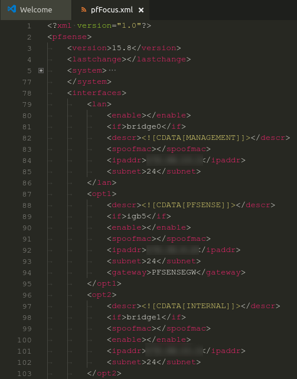
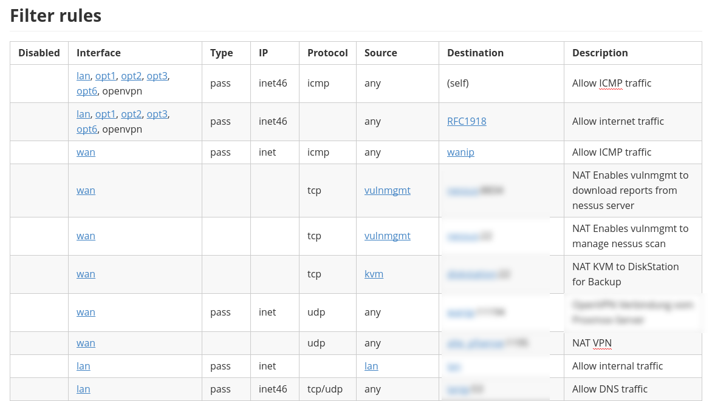

# OPNReport

This simple tool allows you to convert a full configuration backup of a *opn*Sense firewall into some meaningful output format, like Markdown or YAML. It enables you to **focus** on the important parts of your firewall configuration and allows you to get a quick overview of the most important settings.

## Requirements

* Python 3.6+
    * defusedxml==0.5.0
    * PyYAML==5.4

## Screenshots

**Before:** Configuration backup as XML



**After:** Markdown documentation




## Features

OPNReport currently supports the following configuration sections:

* Basic system information
* List of interfaces, VLANs, bridges, gateways and static mappings
* List of DHCP ranges and aliases
* NAT rules with alias and interface resolution
* Outbound NAT rules with alias and interface resolution
* Filter rules with alias and interface resolution
* DNS forwarder (DNSmasq) configuration
* Virtual IPs configuration
* LAGG interfaces
* Unbound Plus configuration
* OpenVPN server and client configurations
* Syslog and sysctl configuration

## Installation

Install into existing Python environment:
```bash
pip install git+https://github.com/AndyX90/OPNReport.git#egg=OPNReport
```

Combine this with `--user` or `pipx` or `pipenv` for isolated installation.

## Usage

Main formatting tool: ```opn-format```
```bash
opn-format
```

Examples:
```bash
./opn-format -i config-backup.xml -f md -o test.md
./opn-format -i config-backup.xml -f yaml -o test.yaml
```

Test parsing tool: ```opn-parse```
```bash
opn-parse [-h] input_path
```

Examples:
```bash
./opn-parse config-backup.xml
```

### Usage via Docker

When using pfFocus via Docker, you don't need to download it from Github, and you don't need to install Python or any libraries. Only Docker is required.

It runs this command inside Docker: `./opn-format -q -f md -i - -o -`, which means it works with `STDIN` and `STDOUT` instead of files.

```bash
docker run --rm -i hghcr.io/tkcert/pffocus < input.xml > output.md
```

If you want you can set up an alias for it in bash:

```bash
alias pffocus="docker run --rm -i ghcr.io/tkcert/pffocus"
```

Then you can use it like a normal Unix command, with pipes and redirects:

```bash
pffocus < input.xml > output.md
```

## Roadmap

Some ideas for the future development of OPNReport:

* Producing additional output formats, especially structured formats like CSV.
* Using these structured formats to enable easy diff'ing of configurations.
* Maybe functionality to correlate rule configurations of different firewalls.

## Credits

* Thomas Patzke ([@thomaspatzke](https://github.com/thomaspatzke)) for
    * valuable suggestions and feedback
* Florian Roth ([@Cyb3rOps](https://twitter.com/Cyb3rOps)) for
    * giving it the name *pfFocus*
    * the very nice and gorgeous logo
