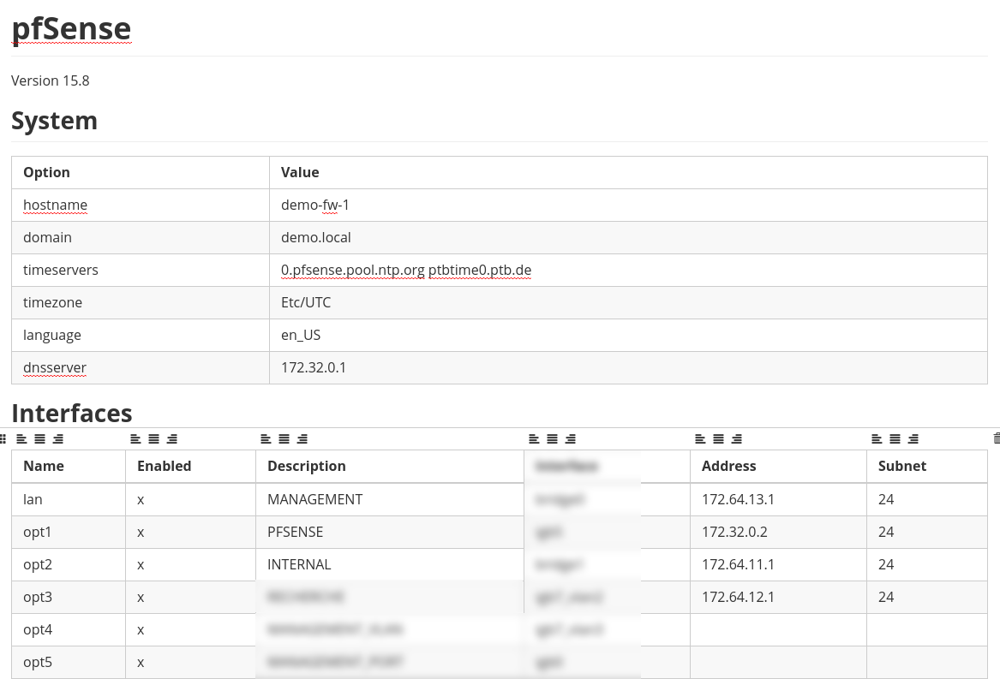

# pfFocus

[](https://travis-ci.org/TKCERT/pfFocus)

This simple tool allows you to convert a full configuration backup of a *pf*Sense firewall into some meaningful output format, like Markdown or YAML. It enables you to **focus** on the important parts of your firewall configuration and allows you to get a quick overview of the most important settings.

## Requirements

* Python 3.5+
    * defusedxml==0.5.0
    * PyYAML==3.12

## Screenshots

**Before:** Configuration backup as XML


**After:** Markdown documentation




## Features

pfFocus currently supports the following configuration sections:

* Basic system information
* List of interfaces, VLANs, bridges, gateways and static mappings
* List of DHCP ranges and aliases
* NAT rules with alias and interface resolution
* Outbound NAT rules with alias and interface resolution
* Filter rules with alias and interface resolution
* DNS forwarder (DNSmasq) configuration
* OpenVPN server and client configurations
* Syslog and sysctl configuration

## Usage

Main formatting tool: ```format.py```
```
format.py
```

Examples:
```
./format.py -i config-backup.xml -f md -o test.md
./format.py -i config-backup.xml -f yaml -o test.yaml
```

Test parsing tool: ```parse.py```
```
parse.py [-h] input_path
```

Examples:
```
./parse.py config-backup.xml
```

## Roadmap

Some ideas for the future development of pfFocus:

* Producing additional output formats, especially structured formats like CSV.
* Using these structured formats to enable easy diff'ing of configurations.
* Maybe functionality to correlate rule configurations of different firewalls.

## Credits

* Thomas Patzke ([@thomaspatzke](https://github.com/thomaspatzke)) for
    * valuable suggestions and feedback
* Florian Roth ([@Cyb3rOps](https://twitter.com/Cyb3rOps)) for
    * giving it the name *pfFocus*
    * the very nice and gorgeous logo
